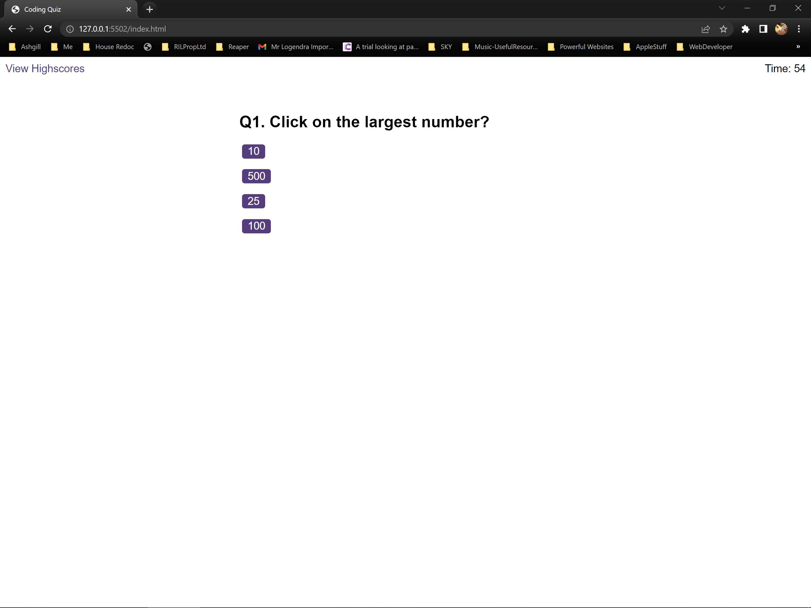

# Code-Quiz

## Table of contents

- [Overview](#overview)
  - [The challenge](#the-challenge)
  - [Screenshot](#screenshot)
  - [Links](#links)
- [My process](#my-process)
  - [Built with](#built-with)
  - [What I learned](#what-i-learned)
  - [Continued development](#continued-development)
  - [Useful resources](#useful-resources)
- [Author](#author)
- [Acknowledgments](#acknowledgments)


## Overview

### The challenge

Build a timed code quiz with multiple-choice questions. The app will run in the browser, and will feature dynamically updated HTML and CSS powered by JavaScript code. It will have a clean, polished, and responsive user interface. 

The timed code quiz will be on Javascript fundamentals and store high scores.

The code quiz will have the following: 

* A start button that when clicked a timer starts and the first question appears.
 
  * Questions contain buttons for each answer.
  
  * When answer is clicked, the next question appears
  
  * If the answer clicked was incorrect then subtract time 10 seconds from the clock

* The quiz should end when all questions are answered or the timer reaches 0.

  * When the game ends, it displays the score and give the user the ability to save their initials and their score


  

### Screenshot




### Links

- Solution URL: [Git Hub Code Quiz](https://github.com/EDX-IL/Code-Quiz)
- Live Site URL: [Code Quiz Webpage](https://edx-il.github.io/Code-Quiz/)

## My process

### Built with

- Semantic HTML5 markup
- CSS custom properties
- Javascript
- LocalStorage
- Mobile-first workflow


### What I learned

- Local Storage
- Timer Intervals
- Synchronous running of functions
- EventListener
- Dynamically Generate HTML

To see how you can add code snippets, see below:

```js
for (
        let index = 0;
        index < questions[currentQuestion].answers.length;
        index++
      ) {
        let answerEl = document.createElement("p");
        let answerButton = document.createElement("button");
        choicesArea.appendChild(answerEl);
        choicesArea.appendChild(answerButton);

        answerButton.textContent = questions[currentQuestion].answers[index];
        answerButton.setAttribute("data-answerIndex", index);
      }
```

```js
  endScreenButtonEl.addEventListener("click", fncSaveHighScore);
```

```js
let timeInterval = setInterval(function () {
    
    quizTimeLeft--;
    timeEl.textContent = quizTimeLeft;

    if (quizTimeLeft < 0) {
      clearInterval(timeInterval);
      timeEl.textContent = "Time's Up!  ";
      blnTimesUp = true;
      fncEndGame();
    }

  
  }, 1000);
```

```js
//standard functions to be used in other scripts to log function name
function getFuncName() {
    return getFuncName.caller.name
}
```


### Continued development

Asynchronous calling of functions. How to wait for user response before continuing to next function.

### Useful resources

- [MDN addEventListener](https://developer.mozilla.org/en-US/docs/Web/API/EventTarget/addEventListener) - This helped me know when the user has clicked a button.
- [MDN setInterval](https://developer.mozilla.org/en-US/docs/Web/API/setInterval) - This helped me create the timer needed for the task. I'd recommend it to anyone still learning this concept.


## Author
  Ian Logendra
- GitHub - [EDX-IL](https://github.com/EDX-IL)


## Acknowledgments

Anton - fellow student. 
Scott (TA)
Andrew (TA)
Jude (TA)
All helped with making progress on the task


